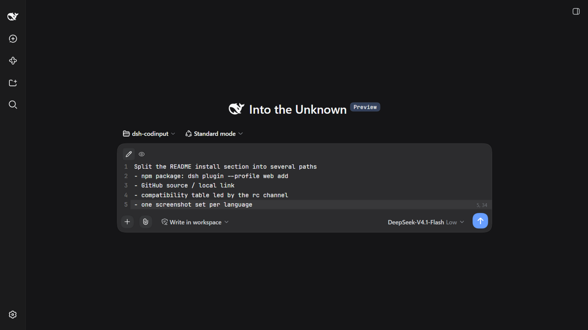
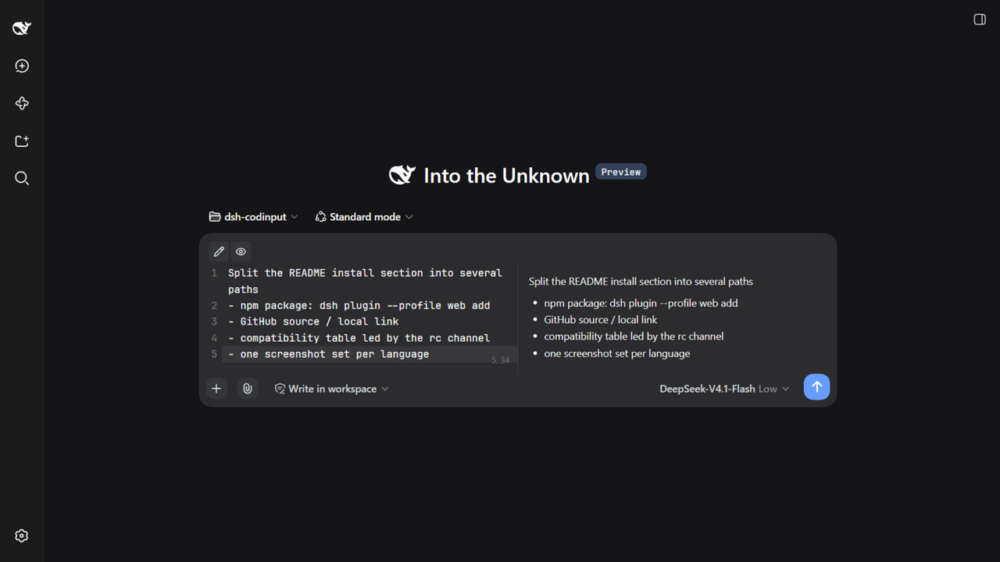
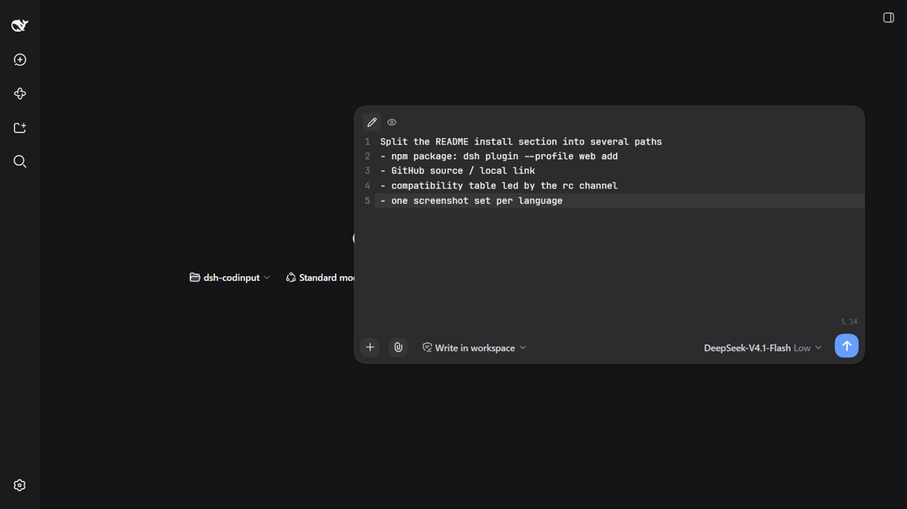
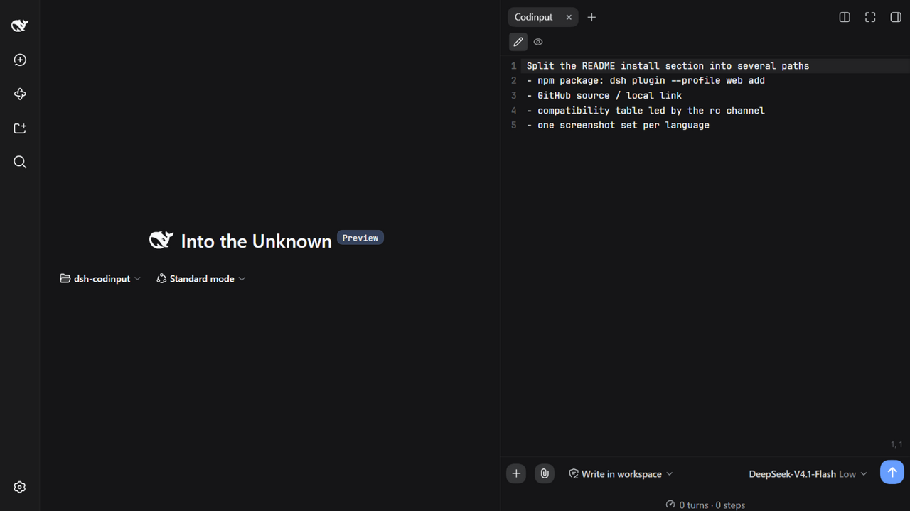

# DSH-Codinput

[中文](./README.md) | English

[](https://www.npmjs.com/package/dsh-codinput)
[](https://github.com/deepseek-ai/deepseek-harness)
[](https://www.npmjs.com/package/dsh-codinput)
[](https://github.com/Witherwithwinter/DSH-Codinput/stargazers)
[](./LICENSE)

> Replaces the DeepSeek Harness WebUI composer with a **code-editor style** input panel: CodeMirror 6 takes over `conversation.composer.bar`, while the official `/` `@` trigger pipeline, model and permission controls, stats projections, and draft persistence are all preserved.

<p>
  
  &nbsp;Icon: lucide <code>file-code-corner</code> (also used as the recall ball when the sidebar is collapsed)
</p>



<table>
  <tr>
    <td width="50%"><br /><sub>Edit + preview split (exactly half and half)</sub></td>
    <td width="50%"><br /><sub>Floating mode (draggable, resizable from all 8 edges/corners)</sub></td>
  </tr>
  <tr>
    <td width="50%"><br /><sub>Sidebar tab mode (full-height, VS Code panel style)</sub></td>
    <td width="50%"><br /><sub>The recall ball shown when the sidebar is collapsed</sub></td>
  </tr>
</table>

<p align="center">
  <sub>Every string goes through the host locale service, so the UI follows the host language setting (中文 / English) — the screenshots above are the English UI, the Chinese ones live in the <a href="./README.md">中文 README</a></sub>
</p>

## Features

**Three modes, one instance** — the input surface exists in exactly one of three states at any moment, and never coexists with the official composer:

| Mode | How to enter | Behaviour |
| --- | --- | --- |
| Normal `normal` | default | The takeover card sits in the composer's own place |
| Floating `float` | drag the blank area of the card's top row | Pops out into a floating window: draggable, resizable from all four edges and four corners (position and size are remembered) |
| Sidebar tab `side` | open the “Codinput” tab in the right sidebar | The input lives in the sidebar panel; **collapsing the sidebar does not give the composer back** — the round ball under the title bar brings it back |

- **Editor**: line numbers (optional), current-line and gutter highlighting, soft wrap, Tab indentation, a line/column indicator, and **undo history that survives mode switches** (drag into floating mode, come back, and `Ctrl+Z` still works).
- **`/` `@`**: entirely the official trigger pipeline (track → official menu store → a faithful MenuView replica): candidate menu, drill-down, crumbs and skeletons match the official UI; the command list is sorted by name for empty queries.
- **Model & reasoning effort**: read from the official shared directory (the same state source as `/model`). **Permissions**: the three official presets plus the RiskConfirmation modal for full access.
- **Attachments**: pick files with the paperclip, **paste images directly**, or **drop files onto the card** (the rail is a faithful replica of the official one: 64×64 image thumbnails, file cards with type glyph/name/size, upload spinner, progress bar, retry on failure).
- **Stats row**: replicated official composer stats (turns/steps · tok/s, total tok · cache hit) plus the context-usage dial, both with detail panels; available in all three modes.
- **Settings**: Settings → Codinput (takeover on/off, line numbers, font, **fully custom send / line-break shortcuts** via a recorder, default view).
- **Draft**: the official input machine is the single source of truth (one write entry point); drafts survive mode switches, plugin toggles, and reloads.

## Installation

Requires the host `@deepseek-ai/dsh` (see compatibility below).

### Method A: npm package

```bash
dsh plugin --profile web add dsh-codinput
```

That single command is enough: `dsh plugin` goes through the official profile package manager, which reads this package's `dsh.bundle` metadata, validates the `cordis.patch.yml` it ships (`dsh.bundle.patch`), and appends the package name to the profile's `bundles` — no hand-written patch entry.

Then start it with `dsh web` (if it is already running, just hard-reload the page — profiles default to `patchReload: live`).

### Method B: GitHub source

```bash
dsh plugin --profile web add github:Witherwithwinter/DSH-Codinput
```

The repository ships the built `lib/`, so a source install **does not need a local build** either. If pnpm asks for build authorisation (for example if you install your own fork with `lib/` removed), write the key it prints into the profile's `pnpm-workspace.yaml` and re-run:

```yaml
allowBuilds:
  esbuild@0.25.12: true
```

### Method C: local source (development)

```bash
git clone https://github.com/Witherwithwinter/DSH-Codinput.git
dsh plugin --profile web add link:/abs/path/to/DSH-Codinput
```

A `link:` install copies nothing, so `npm run build` plus a page reload is enough.

### Method D: the equivalent manual config

To pin a version or maintain the profile by hand, the manual equivalent of **Method A** is (`~/.dsh/profiles/web/package.json`):

```jsonc
{
  "dependencies": {
    "dsh-codinput": "^0.1.0"          // for local development: "link:/abs/path/to/DSH-Codinput"
  },
  "dsh": {
    "profile": {
      "bundles": [
        "@deepseek-ai/dsh-base",
        "@deepseek-ai/dsh-web-app",
        "dsh-codinput"                // ← append last
      ],
      "patchReload": "live"           // after rebuilding lib/client.js, just reload the page
    }
  }
}
```

After editing the profile by hand, run `pnpm install` inside the profile directory (or `dsh plugin --profile web install`), then `dsh web`.

## Compatibility

The host publishes **rc** builds on npm's `latest` tag (`next` is the following rc, `alpha` is the further-ahead channel), so a plain install gives you an rc.

| Host version | Status |
| --- | --- |
| `0.1.5-rc.2` | ✅ Verified on a real instance (this is what a plain install gives you) |
| `0.1.6-alpha.2` | ✅ Current development baseline; every feature verified end to end |
| others | untested |

On top of the real-instance run, `0.1.5-rc.2` was also checked statically: the client packages for that version were pulled from npm and every contract this plugin relies on was confirmed present — the three slots it uses (`conversation.composer.bar`, `sidebar.right.pane.tab`, `settings.section`), the `sidebarRight` / `sidebarRightTabs` / `locale` services and `openTabIn`, the sidebar expansion planner (dockkit `planSetExpanded`), and the official primitives the replicas are copied from (`fileSizeText` / `fileExtension` and the attachment glyph paths, byte for byte). Relative to the development baseline, rc is only missing a few slots the plugin never uses (`conversation.content`, `conversation.input.permission`, `conversation.session.header.leading`, `sidebar.right.tab.guide.entry`). For how to re-run this on another channel, see the “Verifying on another channel” section of [TESTING.md](./TESTING.md).

The plugin leans on host internals (slot shadowing, `useTabInfo`, `sidebarRight`, `--dsw-*` tokens). Every call site guards with `typeof` checks and degrades gracefully, but a major host upgrade can still break it. **After upgrading the host, walk through [TESTING.md](./TESTING.md).**

## Known limitations

- `/` `@` candidates come from host directories (skills / commands / files / sessions); when the host provides none, the menu is empty — the plugin cannot fill that in.
- **No syntax highlighting** and **no Esc behaviour** — deliberate product decisions (this is an input panel, not a code reader).
- While the sidebar tab is visible the composer is hidden entirely (single input surface rule). The official stats dock and context dial live inside the official composer, so they disappear with it and the replicated stats row takes over.
- Duplicating the “Codinput” tab into a second split pane shows a notice instead of a second editor (the input surface stays unique).
- The floating gesture only keeps “drag back to the composer area = normal”; “drag into the right sidebar = sidebar mode” was dropped by product decision.

## Development

```bash
npm install
npm run build        # release bundle → lib/client.js (minified)
npm run build:dev    # unminified + inline sourcemap (readable TypeScript in the browser)
npm run typecheck
```

- `src/client/` holds the whole client side; host APIs are described by local structural types (zero runtime dependency on the host — only `react`/`react-dom` are treated as platform externals).
- `lib/index.js` is the host half (a bare mounting carrier); `lib/client.js` comes from the build and is **committed alongside the source** (that is what lets a source install skip building).
- **CI is a static gate only**: `npm ci` + `tsc --noEmit` + the release build + artifact checks (bundle non-empty, contains `__ModuleLoader__.load`, no inline sourcemap). It never loads a page or connects to the host, so it gives **zero coverage of runtime behaviour** — that lives in the manual checklist in [TESTING.md](./TESTING.md).
- Diagnostics (also present in production): `window.__dshCodinputDebug / __dshCodinputErrs / __dshCodinputSessionId / __dshCodinputTriggers / __dshCodinputKeyboard / __dshCodinputShell / __dshCodinputCtx`.
- Dev helpers: `node scripts/extract-official-css.mjs <host client.js> [out.css]` extracts an official CSS module verbatim (used to replicate official styling value by value).

### Host facts worth knowing before changing code

- **Takeover point**: `conversation.composer.bar` (a `single` slot; `priority:-1` shadows the official entry). Disposing the entry restores the official composer untouched.
- **Single input surface**: a sidebar tab body **counts as carrying the input the moment it mounts** (not based on visibility — collapsing the sidebar is CSS hiding plus a translate, the body stays mounted). The main entry renders `null` accordingly, and the mode is derived as `carrying ? 'side' : prefs.mode`, so coexistence is impossible by construction.
- **Undo history**: switching modes remounts the editor, so `EditorState` is cached per session (`take/putEditorSnapshot`); extension callbacks go through a module-level hooks slot so a reused state never calls into an unmounted instance's props.
- **Official-side writes** (pick / claim / submit-clears) carry `externalAnnotation` + `Transaction.addToHistory.of(false)`, so undo only ever reverts what you typed.
- **Drawing a circle needs `corner-shape: round`**: the host root sets `corner-shape: superellipse(1.5)` globally, so a plain `border-radius:50%` renders as a rounded square.
- **The ball occupies no slot**: `conversation.session.header.corner` is the official sidebar expand button's seat (a `single` slot — taking it would remove the official button), so the ball is portalled to `body` and positioned from the measured header rect.

## Third-party attribution

Parts of this project **replicate DeepSeek Harness** (`@deepseek-ai/dsh`, MIT License, Copyright (c) 2026 DeepSeek): several SVG icon paths (the permission shield set, plus, paperclip, arrow-up, the generic file glyph, …) and CSS values for the composer card and attachment rail. They are used under the MIT license; the original copyright and permission notice are retained in [NOTICE](./NOTICE) alongside [LICENSE](./LICENSE).

Bundled third-party dependencies: CodeMirror 6 (MIT), marked (MIT), DOMPurify (Apache-2.0 / MPL-2.0 dual licensed).

## License

[MIT](./LICENSE)
