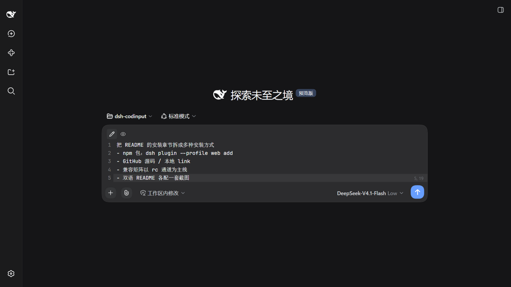
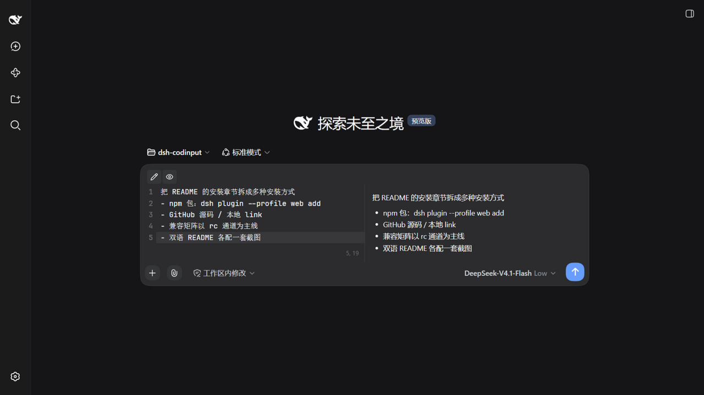
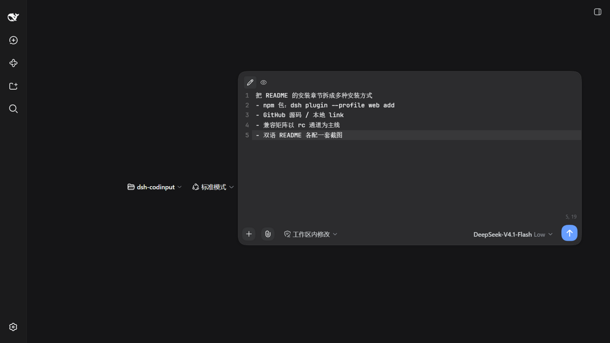
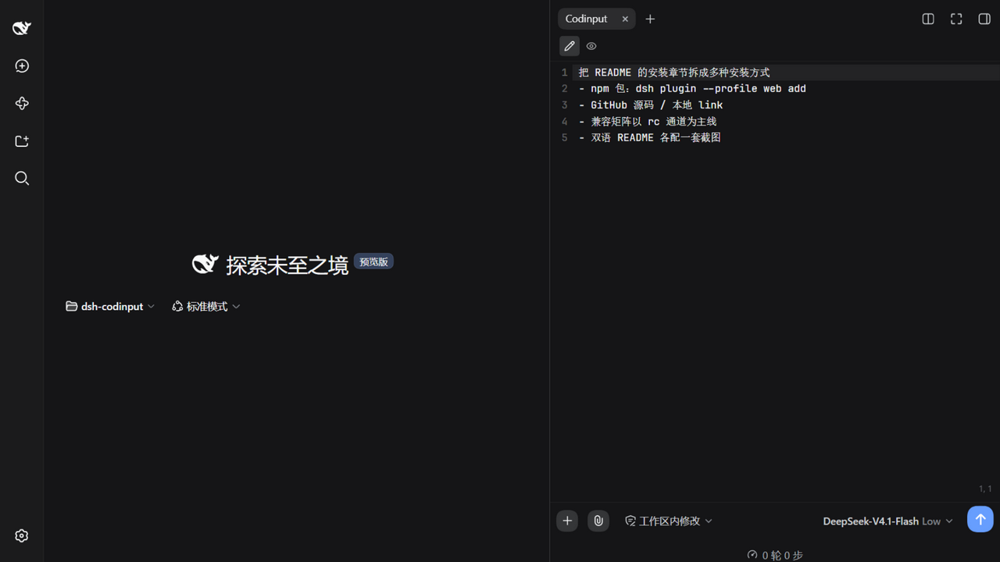
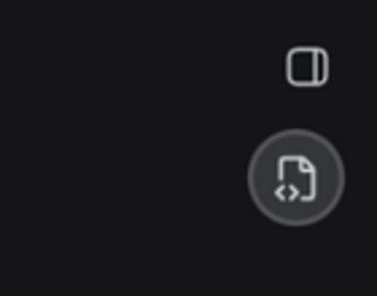

# DSH-Codinput

中文 | [English](./README.en.md)

[](https://www.npmjs.com/package/dsh-codinput)
[](https://github.com/deepseek-ai/deepseek-harness)
[](https://www.npmjs.com/package/dsh-codinput)
[](https://github.com/Witherwithwinter/DSH-Codinput/stargazers)
[](./LICENSE)

> 把 DeepSeek Harness WebUI 的聊天输入框换成**代码编辑器风格**的输入面板：CodeMirror 6 接管 `conversation.composer.bar`，保留官方的 `/` `@` 触发管线、模型与权限控件、统计投影与草稿持久化。

<p>
  
  &nbsp;图标：lucide <code>file-code-corner</code>（同时用作侧栏收起后的唤出小球）
</p>



<table>
  <tr>
    <td width="50%"><br /><sub>编辑 + 预览分屏（严格对半）</sub></td>
    <td width="50%"><br /><sub>悬浮模式（可拖动位置、八向缩放）</sub></td>
  </tr>
  <tr>
    <td width="50%"><br /><sub>侧栏标签模式（VS Code 面板式全高）</sub></td>
    <td width="50%"><br /><sub>侧栏收起时的唤出小球</sub></td>
  </tr>
</table>

<p align="center">
  <sub>界面语言跟随宿主设置（中文 / English）—— 文案全部走宿主 locale 服务，上图为中文界面；英文界面见 <a href="./README.en.md">English README</a></sub>
</p>

## 特性

**三态单实例**——输入入口只有三种形态，任一时刻恰好一个，绝不与官方输入框共存：

| 形态 | 进入方式 | 说明 |
| --- | --- | --- |
| 普通 `normal` | 默认 | 接管卡片在原输入位 |
| 悬浮 `float` | 按住卡片顶部行空白区拖动 | 脱出为悬浮窗：可拖动位置、可拖边界/角落缩放（位置与尺寸记忆） |
| 侧栏标签 `side` | 打开右侧栏的「Codinput」标签 | 输入在侧栏面板内；**侧栏收起不让位**，由标题栏下方的圆形小球唤回 |

- **编辑器**：行号（可关）、当前行与行号高亮、软换行、Tab 缩进、行列指示、**撤销历史跨形态保留**（拖成悬浮/切到侧栏再回来，`Ctrl+Z` 依旧有效）。
- **`/` `@`**：完全走官方触发管线（track → 官方 menu store → 复刻的 MenuView），候选菜单、钻取、crumbs、骨架屏逐项对齐官方；命令菜单顺序在空查询下按名称排序。
- **模型与思考强度**：读官方共享目录（与 `/model` 同一状态源）；**权限**：官方三预设 + 完全权限的 RiskConfirmation 模态。
- **附件**：点 `paperclip` 选文件、**直接粘贴图片**、把文件**拖进卡片**三条路径（失败释放草稿附件，带上传状态芯片）。
- **数据行**：官方 composer stats 复刻（轮次/步数 · tok/s、累计 tok · 缓存命中）+ 上下文占用小圈，均可点开详情面板；主输入/悬浮/侧栏三形态都有。
- **设置**：设置 → Codinput（启用接管、行号、字体、发送/换行快捷键**任意组合录制**、默认视图）。
- **草稿**：官方输入机是唯一事实源（单写入口），形态切换、插件禁用、重启都不丢。

## 安装

要求：宿主 `@deepseek-ai/dsh`（见下方[兼容性](#兼容性)）。

### 方法 A：npm 包

```bash
dsh plugin --profile web add dsh-codinput
```

一条命令就够：`dsh plugin` 走官方 profile 包管理，装完会读这个包的 `dsh.bundle` 元数据、校验它自带的 `cordis.patch.yml`（`dsh.bundle.patch`），并把包名追加进 profile 的 `bundles`——不需要手写任何 patch 行。

然后 `dsh web` 启动（已在跑的话强刷页面即可，profile 默认 `patchReload: live`）。

### 方法 B：GitHub 源码

```bash
dsh plugin --profile web add github:Witherwithwinter/DSH-Codinput
```

仓库里带着构建产物 `lib/`，所以装源码同样**不需要本地构建**。如果 pnpm 提示需要构建授权（例如你换成自己的 fork 且删掉了 `lib/`），按它打印的键名写进 profile 的 `pnpm-workspace.yaml` 后重跑：

```yaml
allowBuilds:
  esbuild@0.25.12: true
```

### 方法 C：本地源码（开发）

```bash
git clone https://github.com/Witherwithwinter/DSH-Codinput.git
dsh plugin --profile web add link:/abs/path/to/DSH-Codinput
```

`link:` 安装不会复制文件，改完 `npm run build` 刷新页面即生效。

### 方法 D：等价的手写配置

想在 profile 里锁版本、或要手工维护时，等价于**方法 A** 的是（`~/.dsh/profiles/web/package.json`）：

```jsonc
{
  "dependencies": {
    "dsh-codinput": "^0.1.0"          // 本地开发用 "link:/abs/path/to/DSH-Codinput"
  },
  "dsh": {
    "profile": {
      "bundles": [
        "@deepseek-ai/dsh-base",
        "@deepseek-ai/dsh-web-app",
        "dsh-codinput"                // ← 追加在最后
      ],
      "patchReload": "live"           // 改完 lib/client.js 强刷页面即生效
    }
  }
}
```

改完手工配置后，在 profile 目录里 `pnpm install`（或 `dsh plugin --profile web install`），再 `dsh web`。

## 兼容性

宿主通过 npm 发的是 **rc** 版本（`latest` 是当前稳定 rc，`next` 是下个 rc，`alpha` 是更超前的通道），所以普通用户装到的就是 rc。

| 宿主版本 | 状态 |
| --- | --- |
| `0.1.7-rc.2` | ✅ 实机实测通过（`next` 通道当前版本；候选菜单亚克力、上下文小圈挪位即为此版对齐） |
| `0.1.5-rc.2` | ✅ 实机实测通过 |
| `0.1.6-alpha.2` | ✅ 开发基线，全部功能端到端实测通过 |
| 其它（含 `latest` 现指向的 `0.1.5-rc.3`） | 未实测；旧宿主无 rc.2 新 token，回退链自动保持各版官方原形态 |

对 `0.1.7-rc.2` 除实机验证外，还从该版本的客户端包（`dsh-client-ui-theme` / `dsh-client-ui-input-trigger` / `dsh-client-ui-conversation`）逐值提取了候选菜单与上下文小圈的官方 CSS 核对。插件依赖的契约按版本核对过：用到的 3 个槽位（`conversation.composer.bar`、`sidebar.right.pane.tab`、`settings.section`）、`sidebarRight` / `sidebarRightTabs` / `locale` 服务与 `openTabIn`、侧栏展开规划（dockkit `planSetExpanded`）、以及复刻所依据的官方原语（`fileSizeText` / `fileExtension` 与附件 glyph 路径，逐字一致）。插件对宿主内部结构的依赖较多（槽位遮蔽、`useTabInfo`、`sidebarRight`、`--dsw-*` 令牌），代码里处处用 `typeof` 守卫 + `try/catch` 降级，但宿主大版本升级仍可能失效。**升级宿主后请按 [TESTING.md](./TESTING.md) 走一遍冒烟清单。**

## 已知限制

- `/` `@` 的候选内容来自宿主目录（技能 / 命令 / 文件 / 会话）；宿主不提供时为空，插件侧无法补。
- **没有语法高亮**、**没有 Esc 功能**——产品决策（输入面板不是代码阅读器）。
- 侧栏标签可见期间主输入整体隐藏（唯一输入入口约定）；官方 stats dock 与上下文小圈都渲染在官方输入框内部，因此随之消失、由本插件的复刻数据行接管。
- 同一 pane 复制出第二个「Codinput」标签时，第二个面板只出提示、不渲染第二个编辑面（输入入口唯一）。
- 悬浮模式的手势只保留「拖回底部输入区 = 普通」；「拖入右侧栏 = 侧栏模式」已按产品决策舍弃。

## 开发

```bash
npm install
npm run build        # 压缩产物 → lib/client.js（发布用）
npm run build:dev    # 未压缩 + 内联 sourcemap（浏览器里直接看 TS 源码）
npm run typecheck
```

- `src/client/` 是全部客户端源码；宿主 API 用本地结构类型描述（运行时零宿主依赖，只把 `react`/`react-dom` 当平台外部模块）。
- `lib/index.js` 是宿主半边（纯挂载载体）；`lib/client.js` 由构建产出，并**入库随源码一起发**（源码安装才能免构建）。
- **CI 只做静态把关**：`npm ci` + `tsc --noEmit` + 发布构建 + 产物自检（bundle 非空、含 `__ModuleLoader__.load`、无内联 sourcemap）。它不加载页面、不连宿主，**运行时行为零覆盖**——行为验证走 [TESTING.md](./TESTING.md) 的手动清单。
- 诊断口（调试用，生产也在）：`window.__dshCodinputDebug / __dshCodinputErrs / __dshCodinputSessionId / __dshCodinputTriggers / __dshCodinputKeyboard / __dshCodinputShell / __dshCodinputCtx`。
- 开发辅助脚本：`node scripts/extract-official-css.mjs <宿主某包 client.js> [out.css]` 抽取官方 CSS module 原文，用于逐值复刻。

### 改代码前值得先知道的宿主事实

- **接管点**：`conversation.composer.bar`（single 槽位，`priority:-1` 遮蔽官方条目）。卸载条目即官方输入框原样恢复。
- **唯一输入入口**：侧栏标签 body **挂载即承载**（不是按可见性——收起侧栏是 CSS 隐藏 + translate，body 仍挂载），主条目据此渲染 `null`；形态由 `承载 ? 'side' : prefs.mode` 派生，构造上不可能并存。
- **撤销历史**：三态切换会重挂载编辑器，故按会话暂存 `EditorState`（`take/putEditorSnapshot`）；扩展回调走模块级 hooks 槽，避免复用旧 state 时调到已卸载实例的 props。
- **官方侧灌入**（pick/claim/提交清空）用 `externalAnnotation` + `Transaction.addToHistory.of(false)`：不进撤销栈，撤销只记用户自己敲的内容。
- **画圆要写 `corner-shape: round`**：宿主根节点设了 `corner-shape: superellipse(1.5)`（全局超椭圆），只写 `border-radius:50%` 会渲染成圆角方。
- **小球不占槽位**：`conversation.session.header.corner` 是官方侧栏展开按钮的座位（single，占它会把官方按钮顶掉），故小球 portal 到 body、量标题栏矩形定位到标题栏下方。

## 第三方归属

本项目的部分视觉素材与样式取值**复刻自 DeepSeek Harness**（`@deepseek-ai/dsh`，MIT License，Copyright (c) 2026 DeepSeek），包括若干 SVG 图标路径（权限盾牌系列、plus / paperclip / arrow-up 等）与输入框卡片的 CSS 取值。依 MIT 许可使用，原始版权与许可声明见仓库根目录 [NOTICE](./NOTICE) 与 [LICENSE](./LICENSE)。

内置第三方依赖：CodeMirror 6（MIT）、marked（MIT）、DOMPurify（Apache-2.0 / MPL-2.0 双许可）。

## 许可

[MIT](./LICENSE)
